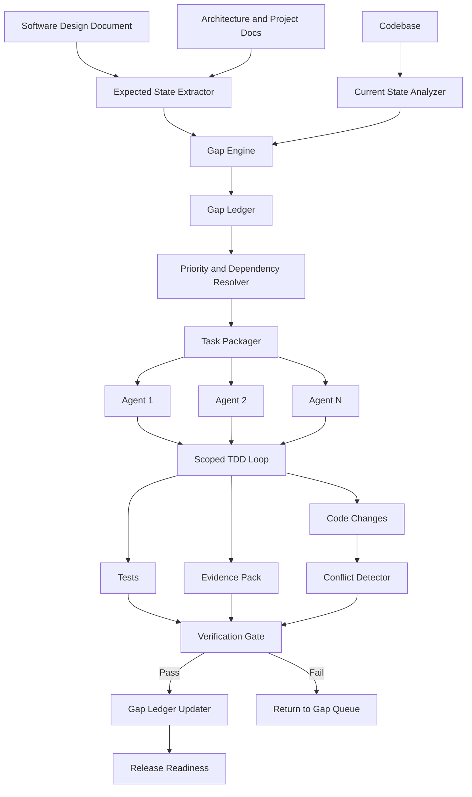

# Architecture Diagram

## Logical Architecture

1. Inputs Layer: SDD, architecture docs, project docs, codebase.
2. Analysis Layer: expected state extractor, current state analyzer, code-grounded assessor.
3. Gap Engine: identifier, classifier, priority resolver, dependency resolver.
4. Planning Layer: runnable selector, task packager, conflict detector, execution planner.
5. Execution Layer: agents, scoped TDD loop, change and test generation.
6. Verification Layer: test runner, contract checker, architecture check, conflict check.
7. Governance Layer: ledger updater, evidence recorder, release summary.
